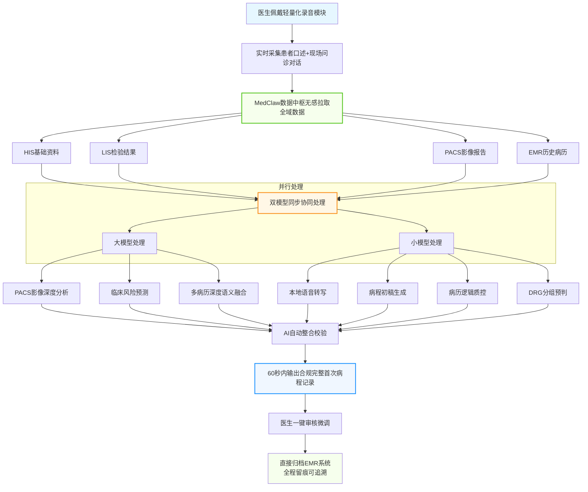
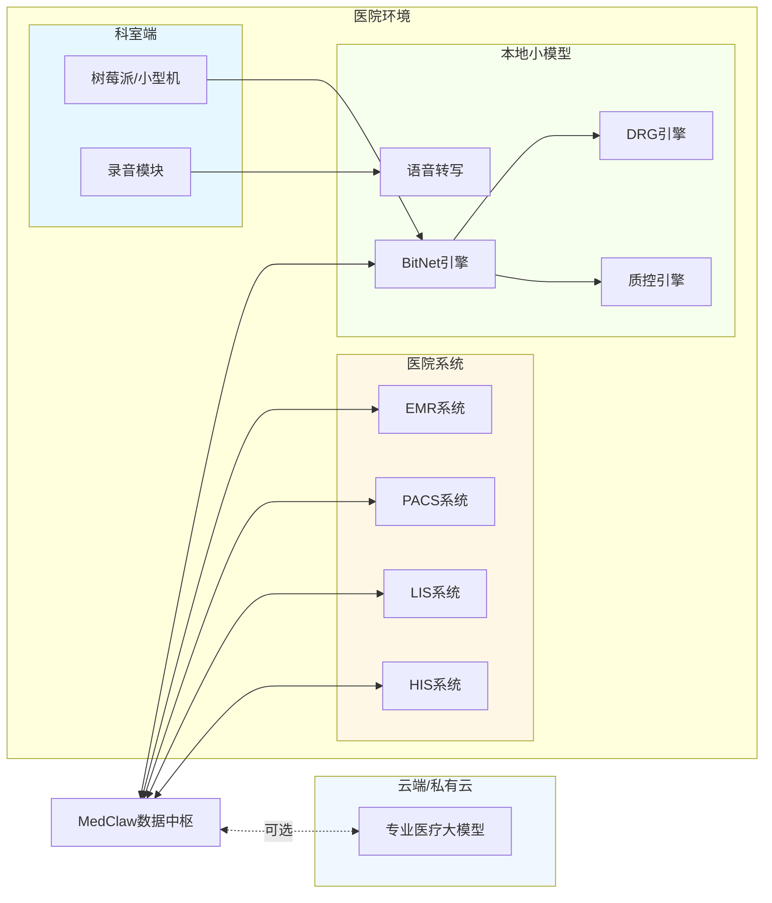
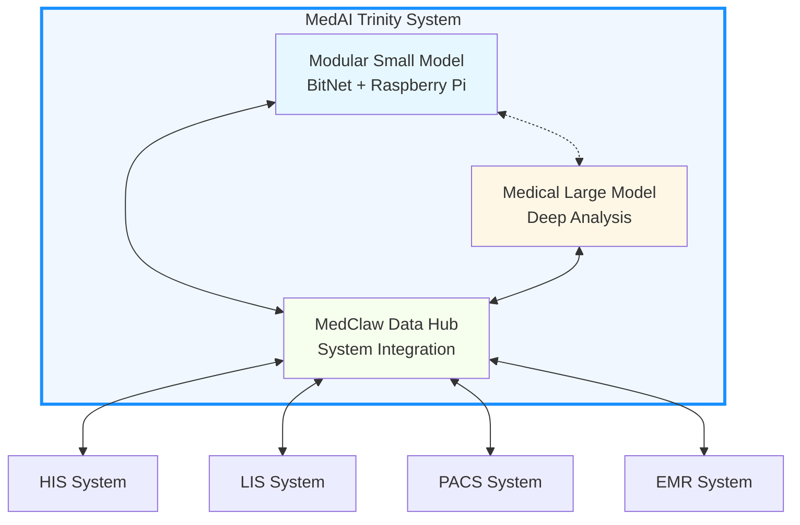

医疗AI三位一体解决方案医疗AI三位一体解决方案

**全球首创模块化医疗AI闭环系统 | 60秒生成合规病历**

***

## 简体中文

### 目录

- [项目简介](#项目简介)
- [核心特性](#核心特性)
- [系统架构](#系统架构)
- [环境搭建](#环境搭建)
- [快速开始](#快速开始)
- [功能模块](#功能模块)
- [配置说明](#配置说明)
- [常见问题](#常见问题)
- [贡献指南](#贡献指南)
- [开源许可](#开源许可)
- [联系方式](#联系方式)

***


### 项目简介

当全球医疗AI还停留在单一模型炫技、系统孤岛难打通、部署成本高不可攀、落地场景悬浮的困境时，**MedAI Trinity   MedAI三一** 跳出传统思维桎梏，打造出架构独创、数据贯通、分工明确、全场景适配的医疗AI终极方案。

**核心创新**：模块化小模型 + 专业医疗大模型 + MedClaw数据中枢，三位一体深度协同，实现一分钟生成合规首次病程记录、病历全逻辑质控、DRG分组前置预判、影像智能分析、临床风险预测全功能覆盖。

> 这绝非普通的技术迭代，而是全球人工智能医院临床应用中，里程碑式的跨越式飞跃。

***


### 核心特性

#### 🚀 极致便携部署

| 特性       | 说明                    |
| -------- | --------------------- |
| **硬件轻量** | 树莓派/小型机承载，机身小巧，无需机房空间 |
| **独立安装** | 单个科室独立采购、安装、运行，即装即用   |
| **成本断崖** | 无需高端GPU集群，科室级预算即可覆盖   |
| **运维极简** | 模块化设计，普通医护人员即可操作维护    |

#### 🔒 数据安全合规

- ✅ 本地离线运算，患者原始数据全程不出院、不上云
- ✅ 彻底杜绝隐私泄露风险
- ✅ 完全符合医疗数据合规要求

#### ⚡ 核心功能覆盖

```
┌─────────────────────────────────────────────────────────────┐
│                    MedAI Trinity 功能矩阵                    │
├─────────────────────────────────────────────────────────────┤
│  📝 病程记录生成    │  60秒生成合规首次病程记录              │
│  ✅ 病历逻辑质控    │  筛查时序矛盾、漏项缺项、用药合规性    │
│  📊 DRG分组预判     │  自动归集诊疗数据、测算盈亏            │
│  🔬 PACS影像分析    │  精准提取影像报告关键特征              │
│  ⚠️ 临床风险预测    │  预判病情演变、预警并发症风险          │
└─────────────────────────────────────────────────────────────┘
```

***

### 系统架构

#### 三位一体核心架构

```mermaid   “‘美人鱼   ```mermaid   “‘美人鱼```mermaid   “‘美人鱼      mermaid   “‘美人鱼```mermaid   “‘美人鱼```mermaid   “‘美人鱼   ```mermaid   “‘美人鱼```mermaid   “‘美人鱼      mermaid   “‘美人鱼```mermaid   “‘美人鱼```mermaid   “‘美人鱼      mermaid   “‘美人鱼```mermaid   “‘美人鱼```mermaid   “‘美人鱼      mermaid   “‘美人鱼```mermaid   “‘美人鱼```mermaid   “‘美人鱼      mermaid   “‘美人鱼```mermaid   “‘美人鱼```mermaid   “‘美人鱼      mermaid   “‘美人鱼```mermaid   “‘美人鱼
graph TB   图结核病
    subgraph MedAI_Trinity["MedAI Trinity 三位一体闭环系统"   "MedAI Trinity 三位一体闭环系统"]subgraph MedAI_Trinity["MedAI Trinity 三位一体闭环系统"   "MedAI Trinity 三位一体闭环系统"]subgraph MedAI_Trinity["MedAI Trinity 三位一体闭环系统"   "MedAI Trinity 三位一体闭环系统"]subgraph MedAI_Trinity["MedAI Trinity 三位一体闭环系统"   "MedAI Trinity 三位一体闭环系统"]subgraph MedAI_Trinity["MedAI Trinity 三位一体闭环系统"   "MedAI Trinity 三位一体闭环系统""MedAI Trinity 三位一体闭环系统"   "MedAI Trinity 三位一体闭环系统"]subgraph MedAI_Trinity["MedAI Trinity 三位一体闭环系统"   "MedAI Trinity 三位一体闭环系统""MedAI Trinity 三位一体闭环系统"   "MedAI Trinity 三位一体闭环系统"]subgraph MedAI_Trinity["MedAI Trinity 三位一体闭环系统"   "MedAI Trinity 三位一体闭环系统""MedAI Trinity 三位一体闭环系统"   "MedAI Trinity 三位一体闭环系统"]subgraph MedAI_Trinity["MedAI Trinity 三位一体闭环系统"   "MedAI Trinity 三位一体闭环系统""MedAI Trinity 三位一体闭环系统"   "MedAI Trinity 三位一体闭环系统"]
        subgraph SmallModel["模块化小模型 (BitNet + 树莓派/小型机)"]subgraph SmallModel["模块化小模型 (BitNet   树莓派/小型机)"]subgraph SmallModel["模块化小模型 (BitNet   树莓派/小型机)"]subgraph SmallModel["模块化小模型 (BitNet   树莓派/小型机)"]subgraph SmallModel["模块化小模型 (BitNet   树莓派/小型机)"]subgraph SmallModel["模块化小模型 (BitNet   树莓派/小型机)"]subgraph SmallModel["模块化小模型 (BitNet   树莓派/小型机)"]subgraph SmallModel["模块化小模型 (BitNet   树莓派/小型机)"]
            HW["硬件特性<br/>   /比;   /比;小巧便携 | 科室独立安装 | 无需机房"]
            COST["成本运维<br/>低成本无高算力 | 模块化易维护"]
            FUNC["核心功能<br/>病程生成 | 病历质控 | DRG预判 | 本地数据安全"]
        end   结束
        
        subgraph LargeModel["专业医疗大模型"]subgraph LargeModel["专业医疗大模型"]subgraph LargeModel["专业医疗大模型"]subgraph LargeModel["专业医疗大模型"]subgraph LargeModel["专业医疗大模型"]subgraph LargeModel["专业医疗大模型"]
            PACS["PACS影像智能分析"]   PACS["PACS影像智能分析"]PACS["PACS影像智能分析"]   PACS["PACS影像智能分析"]PACS["PACS影像智能分析"]   PACS["PACS影像智能分析"]
            RISK["临床病情与并发症风险预测"]
            EMR["多源历史病历深度融合"]
            KNOW["高阶医学知识与诊疗辅助支撑"]
        end   结束
        
        subgraph MedClaw["MedClaw 数据中枢"]subgraph MedClaw["MedClaw 数据中枢"]subgraph MedClaw["MedClaw 数据中枢"]subgraph MedClaw["MedClaw 数据中枢"]subgraph MedClaw["MedClaw 数据中枢"]subgraph MedClaw["MedClaw 数据中枢"]subgraph MedClaw["MedClaw 数据中枢"]subgraph MedClaw["MedClaw 数据中枢"]
            API["零侵入对接 HIS/LIS/PACS/EMR"]API["零侵入对接 HIS/LIS/PACS/EMR"]API["零侵入对接 HIS/LIS/PACS/EMR"]API["零侵入对接 HIS/LIS/PACS/EMR"]API["零侵入对接 HIS/LIS/PACS/EMR"]API["零侵入对接 HIS/LIS/PACS/EMR"]API["零侵入对接 HIS/LIS/PACS/EMR"]API["零侵入对接 HIS/LIS/PACS/EMR"]
            DATA["全域诊疗数据自动归集"]
        end   结束
    end   结束
    
    SmallModel <--> MedClaw
    LargeModel <--> MedClaw
    SmallModel <-.-> LargeModel
    
    style MedAI_Trinity fill:#f0f7ff,stroke:#1890ff,stroke-width:3px
    style SmallModel fill:#e6f7ff,stroke:#1890ff
    style LargeModel fill:#fff7e6,stroke:#fa8c16
    style MedClaw fill:#f6ffed,stroke:#52c41a
```

#### 临床全流程工作流



#### 系统部署架构



#### 三位一体协同优势

| 维度        | 传统方案           | MedAI Trinity          |
| --------- | -------------- | ---------------------- |
| **算力效率**  | 大模型处理所有任务，算力浪费 | 小模型处理高频刚需，大模型专注深度分析    |
| **AI幻觉**  | 单一模型易产生幻觉      | 大模型智能发散 + 小模型硬规则校验双重保障 |
| **部署灵活性** | 需要机房、高算力       | 科室级便携部署，全场景适配          |
| **数据安全**  | 数据需上云处理        | 核心隐私数据全程院内闭环           |

***

### 环境搭建

#### 硬件要求

##### 推荐配置（科室标准版）

| 组件       | 最低配置                  | 推荐配置                        |
| -------- | --------------------- | --------------------------- |
| **计算单元** | Raspberry Pi 4B (8GB) | Raspberry Pi 5 (8GB) / 迷你主机 |
| **存储**   | 64GB SD卡              | 128GB SSD                   |
| **内存**   | 8GB DDR4              | 8GB DDR4                    |
| **网络**   | 100Mbps以太网            | 千兆以太网                       |
| **电源**   | 5V/3A                 | 5V/5A 或更高                   |

##### 企业医务室/基层诊所版

| 组件       | 配置要求                         |
| -------- | ---------------------------- |
| **计算单元** | Raspberry Pi 4B (8GB) 或同等小型机 |
| **存储**   | 64GB SD卡                     |
| **内存**   | 8GB DDR4                     |
| **网络**   | WiFi 5 / 百兆以太网               |

#### 软件依赖

##### 操作系统

```bash
# 推荐系统
Raspberry Pi OS (64-bit) Bullseye/Bookworm
# 或
Ubuntu Server 22.04 LTS (ARM64)
```

##### 核心依赖

```bash
# Python 环境
Python >= 3.9
pip >= 21.0

# 系统依赖
sudo apt-get update
sudo apt-get install -y \
    build-essential \
    cmake \
    git \
    libopenblas-dev \
    liblapack-dev \
    libffi-dev \
    libssl-dev \
    portaudio19-dev \
    ffmpeg

# Python 依赖
pip install numpy scipy pyaudio wave requests
```

##### BitNet 依赖

```bash
# 安装 BitNet 框架
pip install bitnet-cpp

# 或从源码编译
git clone https://github.com/microsoft/BitNet.git
cd BitNet
mkdir build && cd build
cmake ..
make -j$(nproc)
```

#### 安装部署

##### 步骤 1: 克隆仓库

```bash
git clone https://github.com/your-org/medai-trinity.git
cd medai-trinity
```

##### 步骤 2: 安装依赖

```bash
# 创建虚拟环境
python -m venv venv
source venv/bin/activate  # Linux/macOS
# 或 venv\Scripts\activate  # Windows

# 安装项目依赖
pip install -r requirements.txt
```

##### 步骤 3: 配置 MedClaw

```bash
# 复制配置模板
cp config/medclaw.yaml.example config/medclaw.yaml

# 编辑配置文件
nano config/medclaw.yaml
```

配置示例：

```yaml
medclaw:
  his:
    host: "192.168.1.100"
    port: 8080
    api_version: "v2"
    auth:
      type: "oauth2"
      client_id: "your_client_id"
      client_secret: "your_client_secret"
  
  lis:
    host: "192.168.1.101"
    port: 8081
    protocol: "HL7_FHIR"
  
  pacs:
    host: "192.168.1.102"
    port: 11112
    protocol: "DICOM"
    ae_title: "MEDAI_PACS"
  
  emr:
    host: "192.168.1.103"
    port: 8083
    api_version: "v1"
```

##### 步骤 4: 初始化模型

```bash
# 下载预训练模型
python scripts/download_models.py --type small

# 初始化数据库
python scripts/init_db.py

# 验证安装
python scripts/verify_install.py
```

##### 步骤 5: 启动服务

```bash
# 启动核心服务
python main.py --mode production

# 或使用 systemd 服务
sudo systemctl enable medai-trinity
sudo systemctl start medai-trinity
```

***

### 快速开始

#### 5分钟快速体验

```bash
# 1. 启动演示模式
python main.py --mode demo

# 2. 访问 Web 界面
# 打开浏览器访问 http://localhost:8000

# 3. 上传测试数据
# 使用 docs/sample_data/ 目录下的示例数据进行测试
```

#### 基本使用流程

```python
from medai_trinity import MedAITrinity

# 初始化系统
system = MedAITrinity(config_path="config/medclaw.yaml")

# 连接医院系统
system.connect_systems()

# 开始录音采集
system.start_recording()

# 生成病程记录
record = system.generate_medical_record(patient_id="P001")

# 质控检查
qc_result = system.quality_check(record)

# DRG 预分组
drg_result = system.drg_prediction(record)

# 输出结果
print(f"病程记录: {record}")
print(f"质控结果: {qc_result}")
print(f"DRG分组: {drg_result}")
```

***

### 功能模块

#### 模块一：病程记录生成

```python
from medai_trinity.modules import RecordGenerator

generator = RecordGenerator()

# 从录音生成
record = generator.from_audio(
    audio_path="recording.wav",
    patient_info=patient_data
)

# 从对话文本生成
record = generator.from_dialogue(
    dialogue="医生与患者的对话内容...",
    patient_info=patient_data
)
```

#### 模块二：病历逻辑质控

```python
from medai_trinity.modules import QualityController

controller = QualityController()

# 执行质控
result = controller.check(
    record=medical_record,
    check_types=["temporal", "completeness", "medication"]
)

# 查看问题
for issue in result.issues:
    print(f"[{issue.severity}] {issue.description}")
```

#### 模块三：DRG 分组预判

```python
from medai_trinity.modules import DRGPredictor

predictor = DRGPredictor()

# 预测 DRG 分组
prediction = predictor.predict(
    diagnoses=["I10", "E11.9"],
    procedures=["00.66"],
    patient_info=patient_data
)

print(f"DRG组: {prediction.group}")
print(f"预计费用: {prediction.estimated_cost}")
print(f"盈亏分析: {prediction.profit_analysis}")
```

#### 模块四：PACS 影像分析

```python
from medai_trinity.modules import PACSAnalyzer

analyzer = PACSAnalyzer()

# 分析影像报告
analysis = analyzer.analyze(
    dicom_path="images/CT_001.dcm",
    report_type="CT_CHEST"
)

print(f"关键发现: {analysis.findings}")
print(f"诊断建议: {analysis.recommendations}")
```

***

### API 接口文档

MedAI Trinity 提供 RESTful API 接口，支持所有核心功能的调用。详细接口文档请查看 [docs/api/](./docs/api/) 目录。

#### 接口概览

| 接口模块  | 端点前缀              | 说明         | 文档链接                             |
| ----- | ----------------- | ---------- | ---------------------------------- |
| 病程记录  | `/api/v1/records` | 病程记录生成与管理  | [records.md](./docs/api/records.md) |
| 质控服务  | `/api/v1/quality` | 病历逻辑质控检查   | [quality.md](./docs/api/quality.md) |
| DRG服务 | `/api/v1/drg`     | DRG分组预测与分析 | [drg.md](./docs/api/drg.md)         |
| 影像分析  | `/api/v1/imaging` | PACS影像智能分析 | [imaging.md](./docs/api/imaging.md) |
| 系统管理  | `/api/v1/system`  | 系统状态与配置管理  | [system.md](./docs/api/system.md)   |

#### 快速示例

```bash
# 生成病程记录
curl -X POST http://localhost:8000/api/v1/records/generate \
  -H "Authorization: Bearer <your_token>" \
  -H "Content-Type: application/json" \
  -d '{
    "patient_id": "P001",
    "dialogue_text": "患者主诉头痛3天..."
  }'

# 执行质控检查
curl -X POST http://localhost:8000/api/v1/quality/check \
  -H "Authorization: Bearer <your_token>" \
  -H "Content-Type: application/json" \
  -d '{
    "record_id": "REC20240315001",
    "check_types": ["temporal", "completeness", "medication"]
  }'

# DRG分组预测
curl -X POST http://localhost:8000/api/v1/drg/predict \
  -H "Authorization: Bearer <your_token>" \
  -H "Content-Type: application/json" \
  -d '{
    "patient_id": "P001",
    "diagnoses": [{"code": "I10", "name": "原发性高血压"}]
  }'
```

> 📖 完整接口文档请查看 [API文档目录](./docs/api/README.md)

***

### 配置说明

#### 完整配置文件结构

```
config/
├── medclaw.yaml          # MedClaw 数据中枢配置
├── models.yaml           # 模型配置
├── quality_control.yaml  # 质控规则配置
├── drg_rules.yaml        # DRG 分组规则
├── api_server.yaml       # API服务配置
├── web_ui.yaml           # Web界面配置
└── logging.yaml          # 日志配置
```

#### 配置页面一：MedClaw 数据中枢配置

**配置文件：** `config/medclaw.yaml`

**Web配置页面路径：** `/settings/medclaw`

```yaml
medclaw:
  server:
    host: "0.0.0.0"
    port: 8080
    workers: 4
    timeout: 30
  
  his:
    enabled: true
    host: "192.168.1.100"
    port: 8080
    api_version: "v2"
    protocol: "HL7_FHIR"
    auth:
      type: "oauth2"
      client_id: "your_client_id"
      client_secret: "${HIS_CLIENT_SECRET}"
      token_url: "https://his.hospital.com/oauth/token"
    sync_interval: 300
    retry_count: 3
  
  lis:
    enabled: true
    host: "192.168.1.101"
    port: 8081
    protocol: "HL7"
    encoding: "UTF-8"
    sync_interval: 300
  
  pacs:
    enabled: true
    host: "192.168.1.102"
    port: 11112
    protocol: "DICOM"
    ae_title: "MEDAI_PACS"
    query_timeout: 60
  
  emr:
    enabled: true
    host: "192.168.1.103"
    port: 8083
    api_version: "v1"
    auth:
      type: "basic"
      username: "${EMR_USER}"
      password: "${EMR_PASSWORD}"
  
  cache:
    enabled: true
    type: "redis"
    host: "localhost"
    port: 6379
    ttl: 3600
  
  logging:
    level: "INFO"
    file: "/var/log/medai/medclaw.log"
    max_size: "100MB"
    backup_count: 5
```

**配置页面字段说明：**

| 字段             | 类型      | 必填 | 说明                         |
| -------------- | ------- | -- | -------------------------- |
| server.host    | string  | 是  | 服务监听地址                     |
| server.port    | integer | 是  | 服务端口                       |
| his.host       | string  | 是  | HIS系统IP地址                  |
| his.protocol   | enum    | 是  | 协议类型：HL7\_FHIR/HL7/REST    |
| his.auth.type  | enum    | 是  | 认证方式：oauth2/basic/api\_key |
| sync\_interval | integer | 否  | 数据同步间隔（秒）                  |

#### 配置页面二：模型配置

**配置文件：** `config/models.yaml`

**Web配置页面路径：** `/settings/models`

```yaml
models:
  small_model:
    enabled: true
    type: "bitnet"
    path: "./models/bitnet-medical-small"
    device: "cpu"
    parameters:
      context_length: 2048
      max_tokens: 1024
      temperature: 0.7
      top_p: 0.9
      top_k: 40
      repeat_penalty: 1.1
    quantization:
      enabled: true
      bits: 4
      group_size: 128
    performance:
      batch_size: 1
      num_threads: 4
  
  large_model:
    enabled: true
    type: "api"
    provider: "openai_compatible"
    endpoint: "https://api.medical-llm.com/v1"
    model_name: "medical-large-v2"
    api_key: "${MEDICAL_LLM_API_KEY}"
    parameters:
      temperature: 0.3
      max_tokens: 4096
      top_p: 0.95
    rate_limit:
      requests_per_minute: 60
      tokens_per_minute: 100000
    fallback:
      enabled: true
      retry_count: 3
      retry_delay: 5
  
  speech_to_text:
    enabled: true
    type: "whisper"
    model: "whisper-small"
    language: "zh"
    device: "cpu"
  
  embedding:
    enabled: true
    type: "sentence_transformers"
    model: "paraphrase-multilingual-MiniLM-L12-v2"
    dimension: 384
```

**配置页面字段说明：**

| 字段                       | 类型     | 必填 | 说明                        |
| ------------------------ | ------ | -- | ------------------------- |
| small\_model.type        | enum   | 是  | 模型类型：bitnet/llama/chatglm |
| small\_model.device      | enum   | 是  | 运行设备：cpu/cuda/metal       |
| small\_model.temperature | float  | 否  | 生成温度（0-2）                 |
| large\_model.type        | enum   | 是  | 类型：api/local              |
| large\_model.endpoint    | string | 条件 | API端点地址                   |
| large\_model.api\_key    | string | 条件 | API密钥                     |

#### 配置页面三：质控规则配置

**配置文件：** `config/quality_control.yaml`

**Web配置页面路径：** `/settings/quality-control`

```yaml
quality_control:
  global:
    enabled: true
    strict_mode: false
    auto_fix: true
  
  rules:
    - id: "QC001"
      name: "temporal_consistency"
      display_name: "时序逻辑一致性检查"
      enabled: true
      severity: "error"
      description: "检查病历中时间顺序的逻辑一致性"
      parameters:
        check_admission_time: true
        check_discharge_time: true
        check_medication_time: true
    
    - id: "QC002"
      name: "required_fields"
      display_name: "必填项检查"
      enabled: true
      severity: "warning"
      description: "检查病历必填字段是否完整"
      parameters:
        fields:
          - name: "chief_complaint"
            display: "主诉"
            required: true
          - name: "present_illness"
            display: "现病史"
            required: true
          - name: "physical_examination"
            display: "体格检查"
            required: true
          - name: "allergy_history"
            display: "过敏史"
            required: false
          - name: "past_history"
            display: "既往史"
            required: true
    
    - id: "QC003"
      name: "medication_interaction"
      display_name: "药物相互作用检查"
      enabled: true
      severity: "error"
      description: "检查处方药物之间的相互作用"
      parameters:
        database: "./data/drug_interactions.db"
        check_duplicate: true
        check_contraindication: true
        check_dosage: true
    
    - id: "QC004"
      name: "diagnosis_match"
      display_name: "诊断与检查匹配检查"
      enabled: true
      severity: "warning"
      description: "检查诊断与检查结果的一致性"
      parameters:
        min_confidence: 0.7
    
    - id: "QC005"
      name: "icd_coding"
      display_name: "ICD编码规范性检查"
      enabled: true
      severity: "info"
      description: "检查ICD编码的准确性和完整性"
      parameters:
        version: "ICD-10-CM"
        check_mapping: true
  
  notifications:
    enabled: true
    channels:
      - type: "webhook"
        url: "${QC_WEBHOOK_URL}"
        events: ["error", "warning"]
      - type: "email"
        recipients: ["qc@hospital.com"]
        events: ["error"]
```

**配置页面字段说明：**

| 字段                  | 类型      | 必填 | 说明                      |
| ------------------- | ------- | -- | ----------------------- |
| global.strict\_mode | boolean | 否  | 严格模式：警告也阻断提交            |
| global.auto\_fix    | boolean | 否  | 自动修复可修复的问题              |
| rules\[].severity   | enum    | 是  | 严重级别：error/warning/info |
| rules\[].enabled    | boolean | 是  | 是否启用该规则                 |

#### 配置页面四：DRG规则配置

**配置文件：** `config/drg_rules.yaml`

**Web配置页面路径：** `/settings/drg`

```yaml
drg:
  version: "CN-DRG 2.0"
  
  grouping:
    enabled: true
    auto_grouping: true
    confidence_threshold: 0.8
  
  rules:
    - id: "DRG001"
      name: "primary_diagnosis_priority"
      display_name: "主诊断优先规则"
      enabled: true
      description: "主诊断决定DRG分组优先级"
      parameters:
        priority_weight: 1.0
    
    - id: "DRG002"
      name: "procedure_combination"
      display_name: "手术组合规则"
      enabled: true
      description: "多手术组合影响分组"
      parameters:
        max_procedures: 5
    
    - id: "DRG003"
      name: "comorbidity_adjustment"
      display_name: "并发症调整规则"
      enabled: true
      description: "并发症/合并症影响权重"
      parameters:
        cc_list: "./data/cc_list.csv"
        mcc_list: "./data/mcc_list.csv"
  
  cost_analysis:
    enabled: true
    currency: "CNY"
    factors:
      hospital_ratio: 1.0
      region_adjustment: 1.05
  
  alerts:
    enabled: true
    low_profit_threshold: -5000
    high_risk_threshold: -10000
    notify_on:
      - "low_profit"
      - "high_risk"
      - "grouping_uncertain"
```

**配置页面字段说明：**

| 字段                                     | 类型      | 必填 | 说明      |
| -------------------------------------- | ------- | -- | ------- |
| version                                | string  | 是  | DRG版本   |
| grouping.confidence\_threshold         | float   | 否  | 分组置信度阈值 |
| cost\_analysis.factors.hospital\_ratio | float   | 否  | 医院系数    |
| alerts.low\_profit\_threshold          | integer | 否  | 低利润预警阈值 |

#### 配置页面五：Web界面配置

**配置文件：** `config/web_ui.yaml`

**Web配置页面路径：** `/settings/web-ui`

```yaml
web_ui:
  server:
    host: "0.0.0.0"
    port: 8000
    debug: false
    secret_key: "${WEB_SECRET_KEY}"
  
  authentication:
    enabled: true
    type: "local"
    session_timeout: 3600
    max_login_attempts: 5
    lockout_duration: 300
  
  theme:
    default: "light"
    available:
      - "light"
      - "dark"
      - "high_contrast"
    primary_color: "#1890ff"
  
  features:
    voice_recording: true
    real_time_preview: true
    auto_save: true
    auto_save_interval: 60
    export_formats:
      - "pdf"
      - "docx"
      - "html"
  
  dashboard:
    refresh_interval: 30
    show_statistics: true
    show_recent_records: true
    max_recent_items: 10
  
  localization:
    default_language: "zh-CN"
    available_languages:
      - "zh-CN"
      - "en-US"
    date_format: "YYYY-MM-DD"
    time_format: "HH:mm:ss"
```

**配置页面字段说明：**

| 字段                     | 类型      | 必填 | 说明                     |
| ---------------------- | ------- | -- | ---------------------- |
| server.port            | integer | 是  | Web服务端口                |
| authentication.enabled | boolean | 否  | 是否启用认证                 |
| authentication.type    | enum    | 是  | 认证类型：local/ldap/oauth2 |
| theme.default          | enum    | 否  | 默认主题                   |
| features.auto\_save    | boolean | 否  | 是否自动保存                 |

***

### 常见问题

#### Q1: 如何确保数据安全？

**A:** MedAI Trinity 采用本地优先策略：

- 所有核心处理在本地设备完成
- 患者原始数据不离开医院网络
- 可选的云端大模型仅处理脱敏后的特征数据

#### Q2: 支持哪些医院系统对接？

**A:** MedClaw 支持主流医院信息系统：

- HIS: 支持标准 HL7/FHIR 接口
- LIS: 支持 ASTM/HL7 协议
- PACS: 支持 DICOM 标准
- EMR: 支持 CDA 文档标准

#### Q3: 如何处理网络不稳定的情况？

**A:** 系统设计考虑了离线场景：

- 核心功能（病程生成、质控、DRG）完全离线运行
- 大模型功能可选，不影响核心流程
- 数据缓存机制确保断网续传

#### Q4: 是否支持多科室部署？

**A:** 完全支持：

- 每个科室可独立部署一套系统
- 通过 MedClaw 统一对接医院系统
- 支持跨科室数据融合分析

#### Q5: 如何进行模型更新？

**A:** 模块化设计支持独立更新：

```bash
# 更新小模型
python scripts/update_model.py --module small_model

# 更新质控规则
python scripts/update_rules.py --module quality_control

# 更新 DRG 规则
python scripts/update_rules.py --module drg
```

***

### 贡献指南

我们欢迎所有形式的贡献！

#### 如何贡献

1. **Fork** 本仓库
2. **创建特性分支** (`git checkout -b feature/AmazingFeature`)
3. **提交更改** (`git commit -m 'Add some AmazingFeature'`)
4. **推送到分支** (`git push origin feature/AmazingFeature`)
5. **提交 Pull Request**

#### 代码规范

- Python 代码遵循 PEP 8 规范
- 使用 Black 进行代码格式化
- 单元测试覆盖率需达到 80% 以上

#### 提交 Issue

如遇到问题，请通过 [Issues](https://github.com/your-org/medai-trinity/issues) 提交，包含：

- 问题描述
- 复现步骤
- 预期行为
- 实际行为
- 系统环境信息

***

### 开源许可

本项目采用 Apache 2.0 许可证 - 详见 [LICENSE](LICENSE) 文件。

```
Copyright 2024-2026 MedAI Trinity Team

Licensed under the Apache License, Version 2.0 (the "License");
you may not use this file except in compliance with the License.
You may obtain a copy of the License at

    http://www.apache.org/licenses/LICENSE-2.0

Unless required by applicable law or agreed to in writing, software
distributed under the License is distributed on an "AS IS" BASIS,
WITHOUT WARRANTIES OR CONDITIONS OF ANY KIND, either express or implied.
See the License for the specific language governing permissions and
limitations under the License.
```

***

### 联系方式

<div align="center">

**MedAI Trinity Team**

[!\[GitHub\](https://img.shields.io/badge/GitHub-Organization-blue?style=flat-square\&logo=github null)](https://github.com/your-org)
[!\[Email\](https://img.shields.io/badge/Email-Contact-red?style=flat-square\&logo=gmail null)](mailto:contact@medai-trinity.com)
[!\[Website\](https://img.shields.io/badge/Website-Official-green?style=flat-square\&logo=internet-explorer null)](https://medai-trinity.com)

</div>

***

## English

### Table of Contents

- [Introduction](#introduction)
- [Core Features](#core-features)
- [System Architecture](#system-architecture)
- [Installation](#installation)
- [Quick Start](#quick-start-1)
- [Contributing](#contributing)
- [License](#license)
- [Contact](#contact)

***

### Introduction

While the global medical AI landscape remains stuck in single-model demonstrations, isolated systems, high deployment costs, and impractical scenarios, **MedAI Trinity** breaks through traditional constraints with a unique architecture, integrated data, clear division of labor, and full-scenario adaptability.

**Core Innovation**: Modular small model + Professional medical large model + MedClaw data hub, a trinity of deep collaboration, achieving one-minute generation of compliant initial medical records, full logical quality control, DRG pre-grouping, intelligent imaging analysis, and clinical risk prediction.

***

### Core Features

| Feature                    | Description                                          |
| -------------------------- | ---------------------------------------------------- |
| 🚀 **Portable Deployment** | Raspberry Pi/Mini PC, no server room required        |
| 💰 **Cost-Effective**      | Department-level budget, no GPU clusters needed      |
| 🔒 **Data Security**       | Local offline processing, data never leaves hospital |
| ⚡ **60s Generation**       | Compliant medical records in under a minute          |
| ✅ **Quality Control**      | Temporal logic, completeness, medication compliance  |
| 📊 **DRG Prediction**      | Automatic grouping, cost estimation, profit analysis |

***

### System Architecture



***

### Installation

#### Hardware Requirements

| Component | Minimum               | Recommended          |
| --------- | --------------------- | -------------------- |
| Compute   | Raspberry Pi 4B (8GB) | Raspberry Pi 5 (8GB) |
| Storage   | 64GB SD Card          | 128GB SSD            |
| Memory    | 8GB DDR4              | 8GB DDR4             |
| Network   | 100Mbps Ethernet      | Gigabit Ethernet     |

#### Quick Install

```bash
# Clone repository
git clone https://github.com/your-org/medai-trinity.git
cd medai-trinity

# Install dependencies
pip install -r requirements.txt

# Configure MedClaw
cp config/medclaw.yaml.example config/medclaw.yaml

# Start service
python main.py --mode production
```

***

### Quick Start

```python
from medai_trinity import MedAITrinity

# Initialize system
system = MedAITrinity(config_path="config/medclaw.yaml")

# Connect to hospital systems
system.connect_systems()

# Generate medical record
record = system.generate_medical_record(patient_id="P001")

# Quality control
qc_result = system.quality_check(record)

# DRG prediction
drg_result = system.drg_prediction(record)
```

***

### Contributing

We welcome all contributions! Please see our [Contributing Guidelines](#贡献指南) for details.

1. Fork the repository
2. Create a feature branch
3. Commit your changes
4. Push to the branch
5. Submit a Pull Request

***

### License

This project is licensed under the Apache 2.0 License - see the [LICENSE](LICENSE) file for details.

***

### Contact

**MedAI Trinity Team**

- GitHub: <https://github.com/your-org/medai-trinity>
- Email: <contact@medai-trinity.com>
- Website: <https://medai-trinity.com>

***

<div align="center">

**⭐ If this project helps you, please give us a Star! ⭐**

Made with ❤️ by MedAI Trinity Team

</div>
